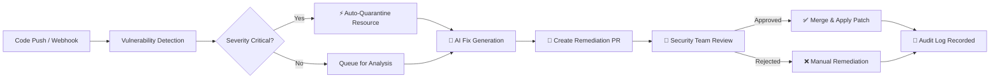

# 🛡️ GuardRail

> **Automated Security & Compliance Guardrails Platform for DevSecOps**  
> Protect cloud infrastructure in real time with automated vulnerability detection, instant resource quarantine, AI-powered remediation patches, and human-in-the-loop approvals.

[](https://react.dev/)
[](https://www.typescriptlang.org/)
[](https://vitejs.dev/)
[](https://tailwindcss.com/)
[](https://nodejs.org/)
[](https://expressjs.com/)
[](LICENSE)

---

## 📖 Table of Contents

- [Overview](#-overview)
- [Key Features](#-key-features)
- [Incident Lifecycle](#-incident-lifecycle)
- [Architecture & Tech Stack](#-architecture--tech-stack)
- [Project Structure](#-project-structure)
- [Getting Started](#-getting-started)
  - [Prerequisites](#prerequisites)
  - [Backend Setup](#backend-setup)
  - [Frontend Setup](#frontend-setup)
- [Interactive Demo Simulation](#-interactive-demo-simulation)
- [API Endpoints](#-api-endpoints)
- [Supported Policy Categories](#-supported-policy-categories)
- [Contributing](#-contributing)
- [License](#-license)

---

## 🌟 Overview

Modern software development moves fast, but security misconfigurations (such as public S3 buckets, exposed AWS credentials, or wildcard IAM policies) can expose critical infrastructure before teams notice. 

**GuardRail** bridges the gap between velocity and security by integrating directly into Git workflows and cloud providers. Whenever a risky commit or infrastructure definition is detected:
1. **Quarantine Immediately**: GuardRail automatically restricts the affected resource to stop immediate exposure.
2. **AI-Driven Code Remediation**: Generates precise Infrastructure-as-Code (Terraform / CloudFormation) patches.
3. **Automated Pull Requests**: Opens a remediation PR with explanation, unified diff, and rollback plans.
4. **Human Review & Audit Trail**: Enables one-click approvals, policy tracking, and immutable audit logging for SOC2 / ISO27001 compliance.

---

## ✨ Key Features

- **⚡ Real-Time Vulnerability Detection**: Identifies exposed secrets, public databases, wildcard IAM permissions, and open security groups.
- **🔒 Automated & Manual Resource Quarantine**: Apply immediate countermeasures (e.g., S3 Block Public Access, IAM credential deactivation).
- **🤖 Generative AI Remediation Engine**: Synthesizes verified Terraform patches and configuration fixes using context-aware AI models.
- **🐙 Automated Pull Request Generator**: Auto-creates branch and PRs directly in GitHub/GitLab with side-by-side diff views.
- **👥 Human-in-the-Loop Governance**: Granular approvals queue with reviewer assignments, risk assessment levels, and feedback loops.
- **📊 Security Posture Analytics**: Interactive charts (powered by Recharts) showing MTTR, policy violation rates, and risk trends.
- **📜 Immutable Audit Log**: Complete event timeline tracking actors (`system`, `ai`, `human`), actions, and correlation IDs.
- **🎮 Live Demo Simulation**: Built-in interactive simulator to run end-to-end incident lifecycles in real time.

---

## 🔄 Incident Lifecycle



---

## 🛠️ Architecture & Tech Stack

### Frontend
- **Framework**: React 19 with TypeScript
- **Bundler / Tooling**: Vite 6
- **Styling**: Tailwind CSS v4 & custom design tokens
- **State Management**: Zustand
- **Icons**: Lucide React
- **Charts & Data Visualization**: Recharts
- **Routing**: React Router DOM v7
- **HTTP Client**: Axios

### Backend
- **Runtime**: Node.js (ES Modules)
- **Server Framework**: Express 4.x
- **Cross-Origin Handling**: CORS
- **Mock State**: In-memory incident store with audit trail generator and webhook receivers

---

## 📂 Project Structure

```text
GaurdRail/
├── backend/
│   ├── package.json         # Backend dependencies (Express, cors)
│   └── server.js            # Mock REST API server, webhook handlers, in-memory store
│
├── frontend/
│   ├── index.html           # Single Page Application HTML shell
│   ├── package.json         # Frontend dependencies & scripts
│   ├── tsconfig.json        # TypeScript compiler configuration
│   ├── vite.config.ts       # Vite configuration with React & Tailwind plugins
│   ├── public/              # Static assets & favicons
│   └── src/
│       ├── App.tsx          # Root application routing
│       ├── main.tsx         # App entry point
│       ├── index.css        # Global CSS & Tailwind styling
│       ├── components/      # Reusable UI components
│       │   ├── AppLayout.tsx
│       │   ├── DemoRunner.tsx     # Live interactive scenario simulator
│       │   ├── Header.tsx
│       │   ├── Sidebar.tsx
│       │   └── ui.tsx             # Badges, buttons, modals, cards
│       ├── pages/           # Application views
│       │   ├── OverviewPage.tsx         # Dashboard posture & metrics
│       │   ├── IncidentsPage.tsx        # Incident list with filters
│       │   ├── IncidentDetailPage.tsx   # Detailed analysis & actions
│       │   ├── PullRequestsPage.tsx     # Generated remediation PRs
│       │   ├── ApprovalsPage.tsx        # Human-in-the-loop review queue
│       │   ├── SecurityPoliciesPage.tsx # Guardrail rules & enforcement
│       │   ├── RemediationQueuePage.tsx # AI patching pipeline status
│       │   ├── RepositoriesPage.tsx     # Monitored repositories
│       │   ├── IntegrationsPage.tsx     # AWS, GitHub, Slack integrations
│       │   ├── AuditLogsPage.tsx        # Compliance audit trail
│       │   └── SettingsPage.tsx         # Platform configuration
│       ├── store/
│       │   └── appStore.ts  # Zustand store for reactive state
│       ├── types/
│       │   └── index.ts     # TypeScript interfaces & types
│       ├── data/
│       │   └── demoData.ts  # Pre-populated realistic security incidents
│       └── utils/
│           └── index.ts     # Helpers for formatting dates, diffs, & statuses
└── README.md                # Project documentation
```

---

## 🚀 Getting Started

### Prerequisites
- **Node.js**: v18.x or higher installed
- **npm**: v9.x or higher (bundled with Node.js)
- **Git**: Installed on your system

---

### Backend Setup

1. Open a terminal and navigate to the backend directory:
   ```bash
   cd backend
   ```

2. Install dependencies:
   ```bash
   npm install
   ```

3. Start the mock backend API server:
   ```bash
   npm start
   ```
   The backend will run on `http://localhost:3001`.

---

### Frontend Setup

1. In a new terminal window, navigate to the frontend directory:
   ```bash
   cd frontend
   ```

2. Install dependencies:
   ```bash
   npm install
   ```

3. Start the Vite development server:
   ```bash
   npm run dev
   ```
   Open your browser and navigate to `http://localhost:5173`.

---

## 🎮 Interactive Demo Simulation

GuardRail includes an interactive **Demo Runner** accessible directly within the dashboard header:

1. Click **"Run Demo Simulation"** in the top navigation bar.
2. Choose from curated security violation scenarios:
   - **Public S3 Bucket** (Terraform configuration vulnerability)
   - **Hardcoded AWS Access Key** (Exposed credentials in source code)
   - **Wildcard IAM Policy** (Privilege escalation risk)
   - **Public RDS Instance** (Database network exposure)
3. Watch the automated security pipeline execute each phase in real time:
   - Webhook trigger & commit ingestion
   - Rule engine analysis & risk classification
   - Instant automated quarantine action
   - Generative AI patch synthesis
   - Pull request creation and notification dispatch
   - Approval recording into the compliance audit log

---

## 📡 API Endpoints

The backend server exposes the following RESTful API endpoints on `http://localhost:3001`:

| Method | Endpoint | Description |
|---|---|---|
| `GET` | `/health` | Health check endpoint |
| `GET` | `/api/incidents` | Retrieve all security incidents |
| `GET` | `/api/incidents/:id` | Fetch specific incident details |
| `POST` | `/api/incidents/:id/quarantine` | Trigger quarantine action on affected resource |
| `POST` | `/api/incidents/:id/approve` | Approve remediation patch and mark incident resolved |
| `POST` | `/api/incidents/:id/reject` | Reject proposed patch with reason |
| `GET` | `/api/audit` | Retrieve complete audit trail events |
| `POST` | `/api/webhooks/github` | Ingest GitHub push and pull request webhooks |
| `POST` | `/api/webhooks/slack/interactions` | Ingest Slack interactive approval actions |

---

## 🛡️ Supported Policy Categories

- **Cloud Storage Security**: Detects and remediates public S3 bucket ACLs and open bucket policies.
- **Secret & Credential Leakage**: Detects committed AWS access keys, private keys, and API tokens.
- **Identity & Access Management (IAM)**: Flags wildcard permissions (`"Action": "*"`), privilege escalation paths, and missing MFA requirements.
- **Network & Database Exposure**: Flags RDS instances with `publicly_accessible = true` and Security Groups allowing unrestricted inbound access (`0.0.0.0/0`).

---

## 👥 Contributing

Contributions, bug reports, and feature requests are welcome!  
Feel free to open an issue or submit a pull request:

1. Fork the repository
2. Create your feature branch (`git checkout -b feature/AmazingFeature`)
3. Commit your changes (`git commit -m 'Add some AmazingFeature'`)
4. Push to the branch (`git push origin feature/AmazingFeature`)
5. Open a Pull Request

---

## 📄 License

This project is licensed under the MIT License.
